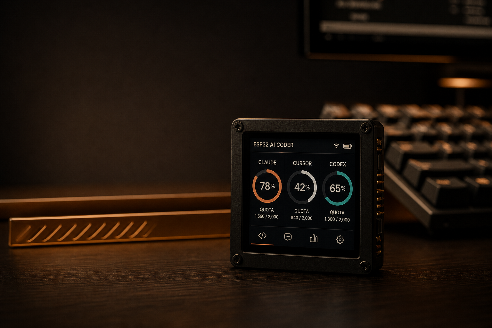

<p align="center">
  
</p>

<h1 align="center">别再为额度切网页了</h1>

<p align="center">
  <b>一块 1.54″ 触屏，把 Claude / Cursor / Codex / GLM 的剩余寿命钉在桌上。</b><br/>
  按住说话 → 字打进当前对话框。密钥永远不进板子。
</p>

<p align="center">
  <a href="https://drdavidda.github.io/ai-coding-desk/desk154-lab.html"><strong>⚡ 0 硬件 · 先玩实验室 UI</strong></a>
  &nbsp;·&nbsp;
  <a href="https://github.com/DrDavidDa/ai-coding-desk/stargazers">⭐ Star</a>
  &nbsp;·&nbsp;
  <a href="#30-秒上手">🚀 开箱</a>
  &nbsp;·&nbsp;
  <a href="docs/ops-landing.md">📖 怎么用</a>
</p>

<p align="center">
  
  
  
  
</p>

---

## 先抄这段去发（可直接转）

> 我把 Claude / Cursor / Codex 的额度做成了一块桌上的小圆屏。  
> Logo 本身就是剩余额度环。按住说话，字打进 Cursor。  
> Cookie 不进板子。没硬件也能玩：  
> https://drdavidda.github.io/ai-coding-desk/desk154-lab.html  
> Repo：https://github.com/DrDavidDa/ai-coding-desk

发完回来点个 Star —— 你的转发是这个项目活下去的理由。

---

## 它在骂谁

| 你现在这样 | Desk154 |
|---|---|
| 打开 4 个网页翻 Usage | **抬头一眼** 谁快没了 |
| 戴耳机、切窗口、找麦 | **板载双麦**，按住 PLUS 就说 |
| 买个无屏宏键盘几百刀 | **微雪 1.54″ 彩屏**，开源，能改 |
| Token 写进固件被人抄走 | **密钥只活在 Windows 主机** |

市售「AI 编程麦克垫」贵、无屏、闭源。  
Desk154：**开源 · 有屏 · 额度可见 · 语音可进对话框**。

---

## 现在这块板子上有什么

2026-08-23 真机（Waveshare ESP32-S3-Touch-LCD-1.54 / SKU 33869）：

- **额度环** — Claude / Cursor / Codex / GLM / Kimi / Trae / 扣子，点进 PLAN 看 5H / 7D / 1M
- **按住说话** — PLUS 录音，松开后主机转写，字打进**当前焦点**的编码窗口（不抢焦点、不回车）
- **三颗实体键** 面对屏幕左→右 **BOOT | PWR | PLUS**  
  短按：回车 / 停止 / 对讲。录音中 PWR = 取消
- **熄屏 / 关机** — PWR 按住约 1.2 秒息屏；继续按到约 3 秒灯闪，**松开才关机**。息屏：点屏或任意键唤醒。关机后只有再按 PWR 能开。5 分钟没人碰也会息屏。真拔电：拔 USB
- **AI 庙 100 签** — 只在额度页连晃 3 下；其它页安静，揣兜里不会乱响
- **六款壁纸** — Wave / Ember / Ink / Phosphor / Night / Stone
- **买家包** — 出厂已刷机 + `Desk154.exe` 向导，客户不用装 Python、不用烧录

密钥、Cookie、JWT **不上板**。板子只显示数字、只传 WAV。

---

## 一屏看懂

```text
┌────────── Desk154 ──────────┐         ┌──── Windows Host ────┐
│ 240×240 触屏 USAGE / PLAN   │ ◄─JSON─ │ 各家 Coding Plan 采集 │
│ 麦 → WAV                    │ ─USB──► │ SenseVoice 转写      │
│ 发送 / 取消 / 讲话 · HID    │ ─HID──► │ 字打进当前输入框     │
└─────────────────────────────┘         └──────────────────────┘
              密钥 / Cookie / JWT  ← 绝不进板子
```

**真机手感**

- 顶栏：**发送 | 取消 | 讲话**（不是 BOOT/PWR/PLUS 英文）
- 两大圆：**麦克风 / 方块结束**；录音秒数 + 脉冲。右侧方块 = 结束并发送，取消只走顶栏或 PWR
- USAGE：Logo 就是额度；点进 **5H / 7D / 1M**（Cursor = **AUTO / API**）
- 长按 PWR 1.2 秒 = 息屏；按满 3 秒再松开 = 关机；5 分钟自动息屏

---

## 🔥 没板子也能玩

打开就滑、就点麦、就进 PLAN：

### 👉 [desk154-lab.html · 实验室 UI](https://drdavidda.github.io/ai-coding-desk/desk154-lab.html)

玩完把链接丢群里 / 小红书 / V2EX / X。  
「截图 + 上面那段文案」= 完整传播包。

---

## 30 秒上手

**买家（推荐）** — 盒子里已刷机。解压 `Desk154-Windows.zip`，双击 `Desk154.exe`，插上数据线，点「一键配对」。说明：[docs/setup-buyer.md](docs/setup-buyer.md)

<details>
<summary><b>开发机 · Windows Host</b></summary>

```bat
cd host
py -3 -m pip install -r requirements.txt
set DESK_NO_TRAY=1
py -3 -u desk_host.py
```

`http://127.0.0.1:8787` · 密钥放 `host/secrets/`（已 gitignore）
</details>

<details>
<summary><b>开发机 · 固件</b></summary>

板子：Waveshare **ESP32-S3-Touch-LCD-1.54** · SKU **33869** · Flash **DIO 16MB**

```bat
cd firmware
pio run -e waveshare_lcd_154
```

应用口通常 COM8，下载口 COM7。烧录流程见 [docs/handoff.md](docs/handoff.md)。  
**禁止**误刷其它 ESP。
</details>

---

## 仓库地图

```
firmware/   ESP32-S3 · 触屏 / 麦 / 三键 / 额度 / 抽签 / 壁纸
host/       额度采集 · 转写 · 注入 · 买家向导
docs/       原型 · 开箱说明 · GitHub Pages
```

---

## 安全一句话

**板子只显示数字。Token 死在 Host。**

---

## 一起把它打爆

| 你能做的 | 为什么重要 |
|---|---|
| ⭐ Star | 排序与曝光 |
| 转发 Demo 链接 | 0 门槛种草 |
| Issue / PR 新厂商额度 | 生态变厚 |
| 晒桌面实拍 | 内容燃料 |

<p align="center">
  <b>桌上多一盏额度灯，少切一次网页。</b><br/><br/>
  <a href="https://github.com/DrDavidDa/ai-coding-desk">⭐ Star this repo</a>
  &nbsp;·&nbsp;
  <a href="https://drdavidda.github.io/ai-coding-desk/desk154-lab.html">▶ Play the lab demo</a>
</p>
