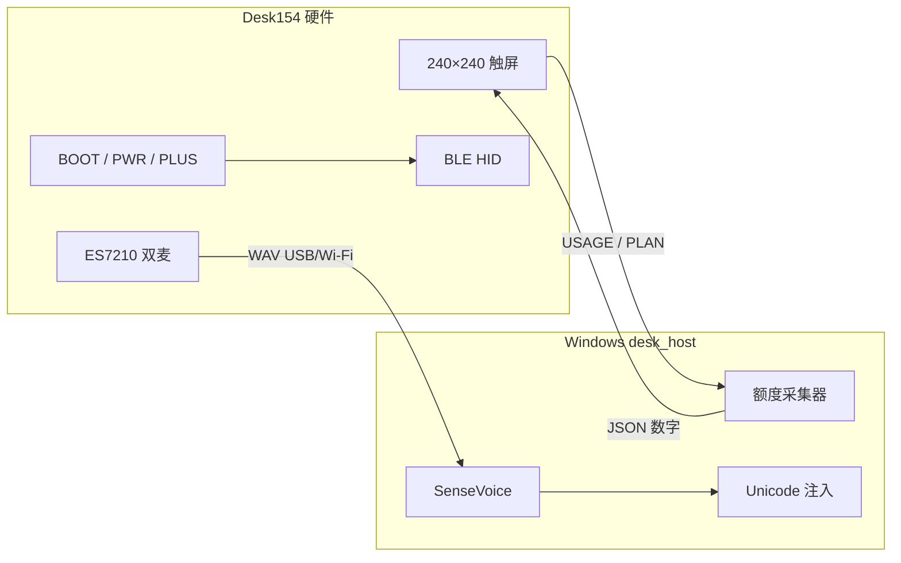

# Desk154 — 桌面上的 AI Coding 额度屏 + 语音键

> **一块 1.54″ 触屏 ESP32，盯着你所有 Coding Plan 的剩余算力，按住就能说话打进 Cursor。**  
> 不把 Cookie / JWT 写进设备。额度在 Windows 上采，数字在桌上亮。

[**▶ 打开交互原型（240×240 模拟）**](https://drdavida.github.io/ai-coding-desk/desk154-live.html) · [硬件引脚](docs/hardware.md) · [落地用法](docs/ops-landing.md) · [安装](docs/setup.md)

---

## 为什么值得 Star / 反复回来看

| 痛点 | Desk154 |
|---|---|
| Coding Plan 额度藏在网页深处 | 桌面常亮：Claude Code / Codex / Cursor / GLM / Kimi / Trae / Coze… |
| 说话还要切窗口、找麦克风 | 板载双麦 PTT → PC SenseVoice → 字直接打进当前输入框 |
| 市售 Codex Micro 贵且无屏 | 微雪 1.54″ 彩屏 + 三键 + 可选 WS2812，自己刷固件 |
| 密钥跟着固件走 | **Secrets 只在 `desk_host`，设备只收数字与按键** |

交互原型和真机 UI 同源设计语言——改完原型再刷板，回访成本极低。

---

## 一屏看懂



**顶栏三键（面对屏幕 L→R）：发送 | 取消 | 讲话**  
**TALK 页：** 大圆麦克风 / 禁止；录音计时 + 脉冲。  
**USAGE：** Logo 本身就是额度环；点进 PLAN → **5H / 7D / 1M**（Cursor 据实 **AUTO / API**）。  
**Claude Code 接 DeepSeek 时：** 仍显示 Claude Code 品牌页，余额脚注 `YUAN x.xx`。

---

## 仓库结构

```
ai-coding-desk/
├── firmware/          # PlatformIO · waveshare_lcd_154 · LVGL 8
├── host/              # desk_host.py · collectors · SenseVoice · HID 注入
├── chrome-extension/  # Cursor usage 辅助（可选）
└── docs/
    ├── desk154-live.html   # 可点的 UI 原型（建议先玩这个）
    ├── hardware.md
    ├── setup.md
    └── ops-landing.md
```

---

## 快速开始

### 1. 主机（Windows）

```bat
cd host
py -3 -m pip install -r requirements.txt
set DESK_NO_TRAY=1
py -3 -u desk_host.py
```

服务默认 `http://127.0.0.1:8787`，密钥见 `host/secrets/host_key.txt`（勿提交）。

### 2. 固件（Desk154，SKU 33869）

```bat
cd firmware
pio run -e waveshare_lcd_154
```

烧录注意：应用口多为 **COM8**，下载口 **COM7**；**DIO 16MB**，勿刷到其它 ESP。详见 [docs/handoff.md](docs/handoff.md)。

### 3. 先玩原型（零硬件）

浏览器打开 [desk154-live.html](https://drdavida.github.io/ai-coding-desk/desk154-live.html)  
（本地：`docs/desk154-live.html`）。可与本机 `desk_host` 同步额度。

---

## 能力清单

- [x] 多厂商 Coding Plan 额度环 + PLAN 详情
- [x] 触屏滑动：DESK → USAGE → PACK；待机时钟
- [x] PLUS 按住说话 / 触屏麦克风点按录音
- [x] BLE HID：发送 / 取消 / 讲话
- [x] Cursor AUTO+API；GLM 5H/7D/1M；Claude Code 品牌 + DeepSeek 余额
- [x] 额度告警水滴音
- [ ] 更多厂商一键开关（原型里已可点 chip）

---

## 安全边界

| 在 Host | 绝不进固件 |
|---|---|
| Anthropic / DeepSeek / 智谱 / Cursor token | Cookie、JWT、API Key |
| SenseVoice API Key | |

设备只显示百分比与元，串口/Wi‑Fi 只推数字 JSON。

---

## 硬件

Waveshare **ESP32-S3-Touch-LCD-1.54**（SKU **33869**）  
引脚与 BOM：[docs/hardware.md](docs/hardware.md)

---

## License

按仓库内声明使用；第三方 Logo / 商标归原厂商，仅用于额度展示识别。

---

<p align="center">
  <b>桌上多一盏额度灯，少切一次网页。</b><br/>
  Star 一下，改完原型再回来刷机。
</p>
